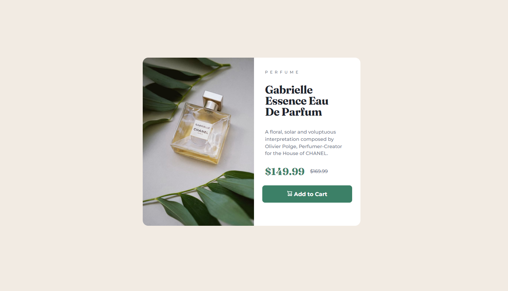

<h1 align="center"> Card de Preview Product</h1>

Projeto frontend realizado através dos desafios do site <a href="https://www.frontendmentor.io/challenges/product-preview-card-component-GO7UmttRfa">Frontend Mentor  

  <a href="#-tecnologias">Tecnologias</a>&nbsp;&nbsp;&nbsp;|&nbsp;&nbsp;&nbsp;
  <a href="#-projeto">Projeto</a>&nbsp;&nbsp;&nbsp;|&nbsp;&nbsp;&nbsp;
  <a href="#-layout">Comentários</a>&nbsp;&nbsp;&nbsp;&nbsp;&nbsp;&nbsp;

 
<h2 align="center">Proposto:</h2>

  

<h2 align="center">Realizado:</h2>

  

## 🚀 Tecnologias

Esse projeto foi desenvolvido com as seguintes tecnologias:

- HTML e CSS
- JavaScript
- Git e Github

## 💻 Projeto

Card simples para pré-visualização de um produto.

- [Visite o projeto online](https://diegoweb3r.github.io/Product-preview-card-component/)

## :book: Comentários
A dificuldade dos desafios do Frontend Mentor, na modalidade gratis, é a falta de medidas. Acertar as medidas no olho, é demorado e dificil. Para mim, outra dificuldade que preciso melhorar, é a responsividade.

Feito por Diego Web3r
